# PetFeeder

<a href="#français" target="_blank">Français</a> | <a href="#english" target="_blank">English</a>

---

## English

### Overview
PetFeeder is an open-source firmware to retrofit stepper-based pet feeders (auger type) with Wi-Fi connectivity for any animal that eats kibble.
It was born from the need to network-enable the paid <a href="https://ko-fi.com/s/698e04b7e3" target="_blank">PEDRO feeder by Manutechlab</a>
(<a href="https://www.youtube.com/watch?v=Uv0lsih8JRA" target="_blank">YouTube video</a>), which adjusts with two potentiometers and lacks connectivity.
While our build uses the PEDRO mechanical kit, the ESP8266 + A4988 setup can drive any dispenser based on a NEMA17 or similar stepper motor.
It offers a modern web interface, daily schedule, OTA updates and optional MQTT/webhook integrations.

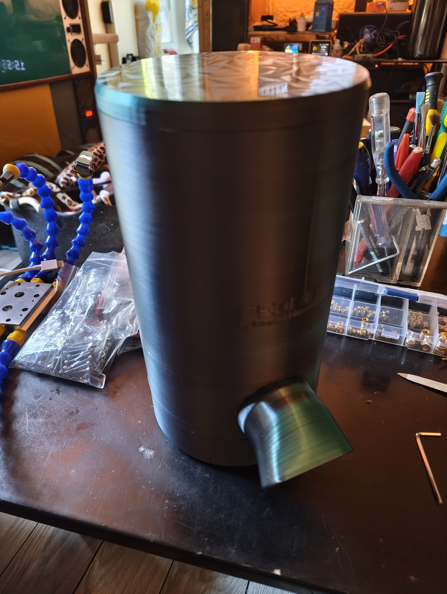

### Features
- Self‑hosted Wi‑Fi configuration portal (WiFiManager)
- Responsive Web UI with schedule management and manual actions
- Daily quota tracking with 7‑day history chart
- Expert mode toggle to reveal advanced settings
- OTA firmware updates with configurable password
- Local JSON API endpoints
- Physical button for feed/unclog/safe‑mode toggle
- Optional MQTT and webhook notifications

### Hardware
- Wemos D1 mini (ESP8266)
- A4988 stepper driver
- NEMA17 stepper motor
- 12 V power supply + 100–220 µF capacitor
- Push button between D2 and GND
- 3D printed parts from the paid <a href="https://ko-fi.com/s/698e04b7e3" target="_blank">PEDRO project by Manutechlab</a>
  (<a href="https://www.youtube.com/watch?v=Uv0lsih8JRA" target="_blank">YouTube video</a>); any NEMA17‑based feeder can be adapted

### Wiring
| Wemos D1 mini | A4988 | Notes |
|---------------|-------|-------|
| D5 (GPIO14)   | DIR   | direction |
| D6 (GPIO12)   | STEP  | step pulse |
| D7 (GPIO13)   | EN    | LOW = enabled |
| 3V3           | VDD   | logic power |
| 3V3           | SLEEP & RESET | bridge together |
| 12V           | VMOT  | motor power |
| GND           | GND   | common ground |

Motor coils (NEMA17 17HE12‑1204S example):
- Coil A → A4988 1A/1B: black / blue
- Coil B → A4988 2A/2B: green / red

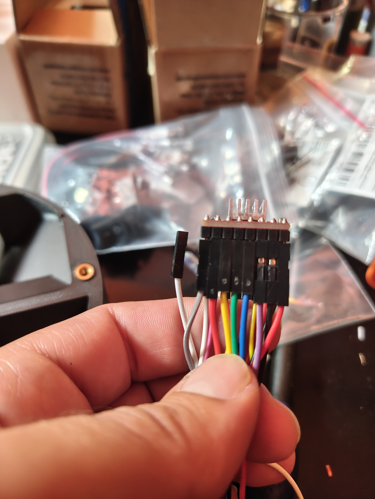
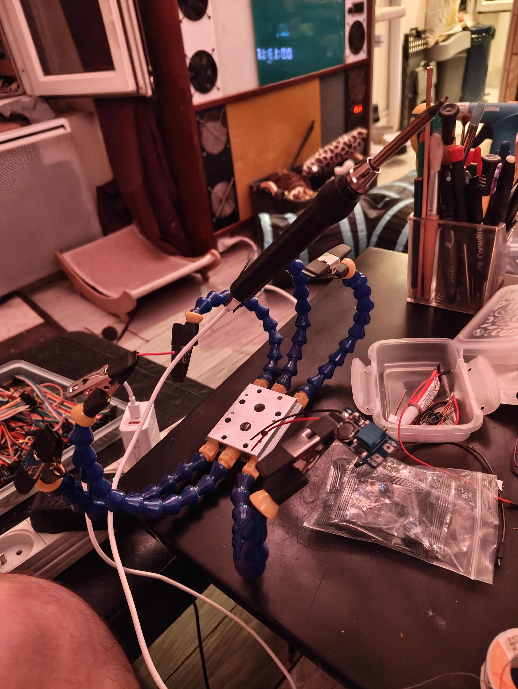

### Software Setup
1. Install <a href="https://www.arduino.cc/en/software" target="_blank">Arduino IDE</a> or `arduino-cli` with ESP8266 board package.
2. Open `PetFeeder_code_V3.1.ino` and select **ESP8266 › LOLIN(Wemos) D1 R2 & mini**.
3. Flash the board. On first boot the access point `<device_name>-SETUP` will appear.
4. Connect and configure Wi‑Fi credentials, timezone, quotas, etc.

Below are screenshots of the web interface:

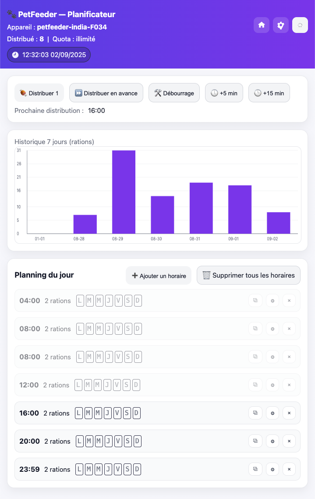
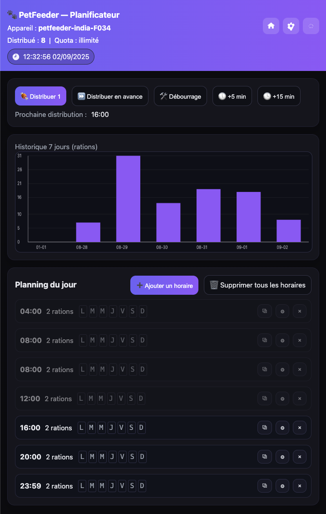
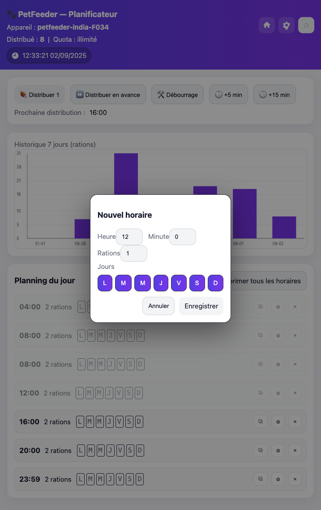
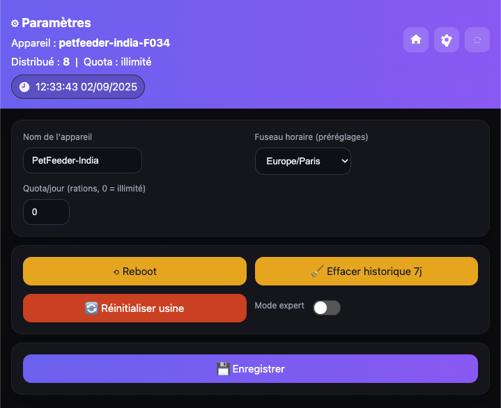
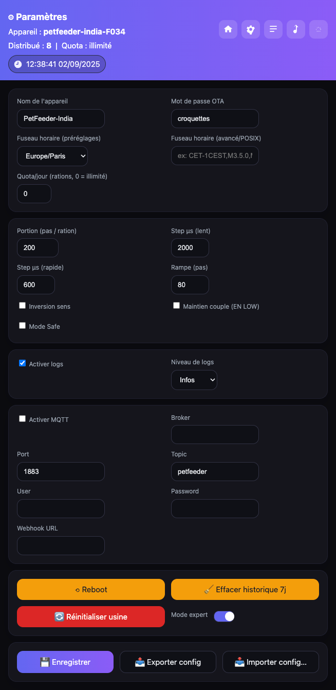
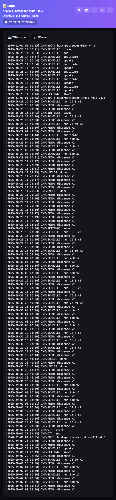
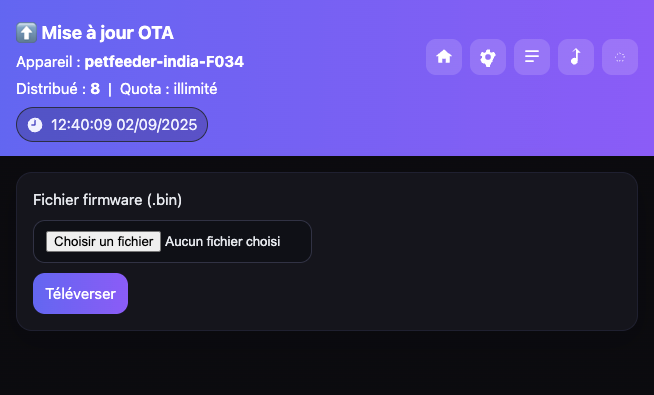
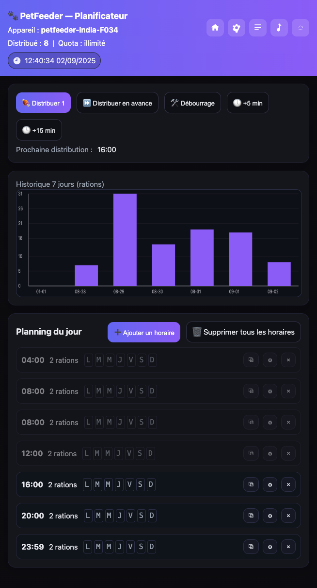

### API & MQTT
- `GET /status` – JSON state
- `GET /feed?n=1` – dispense `n` rations
- `GET /unclog` – reverse/forward to clear jams
- `/api/schedule` – GET/POST schedule
- MQTT topic prefix: `<cfg.mqtt_topic>` (e.g. `petfeeder/cmd/feed`)

### Credits
Mechanical design derived from the PEDRO project by Manutechlab. Electronics and firmware rewritten for ESP8266 connectivity.

### License
This project is released under the MIT License. See <a href="LICENSE" target="_blank">LICENSE</a>.

---

## Français

### Aperçu
PetFeeder est un firmware open-source pour connecter des distributeurs de croquettes pour animaux à moteur pas-à-pas (type vis sans fin) via le Wi-Fi.
Il est né du besoin de rendre connecté le projet payant <a href="https://ko-fi.com/s/698e04b7e3" target="_blank">PEDRO de Manutechlab</a>
(<a href="https://www.youtube.com/watch?v=Uv0lsih8JRA" target="_blank">vidéo YouTube</a>) qui se règle avec deux potentiomètres et n'est pas connecté.
Même si les exemples utilisent le kit mécanique PEDRO, ce firmware peut rendre connecté n'importe quel distributeur basé sur un moteur NEMA17 ou équivalent.
Il propose une interface web moderne, un planning journalier, des mises à jour OTA et des intégrations MQTT/webhook facultatives.

### Fonctionnalités
- Portail de configuration Wi‑Fi autonome (WiFiManager)
- Interface Web responsive pour gérer le planning et les actions manuelles
- Suivi du quota journalier avec graphique sur 7 jours
- Mode Expert pour afficher les paramètres avancés
- Mises à jour OTA avec mot de passe configurable
- API JSON locale
- Bouton physique pour nourrir/débourrer/activer le mode sécurisé
- Notifications MQTT et webhook en option

### Matériel
- Wemos D1 mini (ESP8266)
- Driver A4988
- Moteur pas‑à‑pas NEMA17
- Alimentation 12 V + condensateur 100–220 µF
- Bouton poussoir entre D2 et GND
- Pièces imprimées en 3D : projet payant <a href="https://ko-fi.com/s/698e04b7e3" target="_blank">PEDRO de Manutechlab</a>
  (<a href="https://www.youtube.com/watch?v=Uv0lsih8JRA" target="_blank">vidéo YouTube</a>) ; tout distributeur à moteur NEMA17 peut être adapté

### Câblage
| Wemos D1 mini | A4988 | Notes |
|---------------|-------|-------|
| D5 (GPIO14)   | DIR   | sens de rotation |
| D6 (GPIO12)   | STEP  | impulsion de pas |
| D7 (GPIO13)   | EN    | LOW = activé |
| 3V3           | VDD   | alimentation logique |
| 3V3           | SLEEP & RESET | ponter ensemble |
| 12V           | VMOT  | puissance moteur |
| GND           | GND   | masse commune |

Bobines moteur (ex. NEMA17 17HE12‑1204S) :
- Bobine A → A4988 1A/1B : noir / bleu
- Bobine B → A4988 2A/2B : vert / rouge

### Mise en route
1. Installer l'<a href="https://www.arduino.cc/en/software" target="_blank">IDE Arduino</a> ou `arduino-cli` avec la carte ESP8266.
2. Ouvrir `PetFeeder_code_V3.1.ino` et choisir **ESP8266 › LOLIN(Wemos) D1 R2 & mini**.
3. Téléverser le firmware. Au premier démarrage, le point d'accès `<device_name>-SETUP` apparaît.
4. S'y connecter pour configurer le Wi‑Fi, le fuseau horaire, les quotas, etc.

Voici quelques captures d’écran de l’interface :

### API & MQTT
- `GET /status` – état en JSON
- `GET /feed?n=1` – distribue `n` rations
- `GET /unclog` – débloque la vis sans fin
- `/api/schedule` – GET/POST du planning
- Préfixe de topic MQTT : `<cfg.mqtt_topic>` (ex. `petfeeder/cmd/feed`)

### Remerciements
Design mécanique dérivé du projet PEDRO de Manutechlab. Électronique et firmware réécrits pour l’ESP8266.

### Licence
Ce projet est publié sous licence MIT. Voir <a href="LICENSE" target="_blank">LICENSE</a>.

